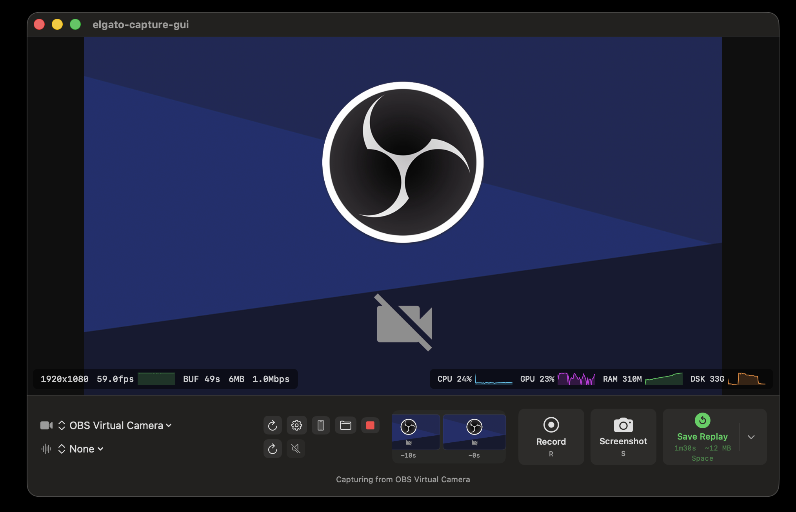

# Elgato Mac Tool



Hardware-accelerated 1080p60 capture for Elgato (and other UVC) devices on macOS — built on AVFoundation and VideoToolbox. Ships a SwiftUI menu-bar app and a minimal CLI, sharing a single capture engine.

Originally lived inside [obs-remote](https://github.com/) as `elgatomactool/`; extracted here as its own repo.

## Features

- **1080p60 capture** with hardware H.264/HEVC encoding via VideoToolbox.
- **Replay buffer** — keep the last N seconds of footage in RAM, save on demand.
- **Recording, screenshots, replay save** — keyboard shortcuts in the CLI, buttons + menu-bar items in the GUI.
- **SwiftUI GUI** with live preview, audio meter, FPS/bitrate/CPU/GPU/RAM/disk telemetry and sparklines.
- **Mobile remote (PWA)** — the GUI ships an embedded web server that hosts a Framework7-based PWA. Scan the QR, control everything from your phone over LAN, PSK-protected.
- **Apple Silicon native** — NV12 throughout, no color conversion, typical CPU < 5% on M2.

## Requirements

- macOS 13 or later
- Swift 5.9 toolchain (Xcode 15+ or matching command-line tools)
- An Elgato (or other AVFoundation-visible) capture device
- Camera access granted in System Settings → Privacy & Security → Camera

## Build & run

```bash
# GUI (default)
./run.sh
# or explicitly
swift run elgato-capture-gui

# CLI
swift run elgato-capture
swift run elgato-capture --help
swift run elgato-capture --list-devices
```

Output files land in `~/Movies/ElgatoCapture/`.

## Targets

The package (`Package.swift`) defines three targets:

| Target | Kind | Path | Description |
|---|---|---|---|
| `CaptureCore` | library | `Sources/CaptureCore` | Capture engine, encoder, recorder, replay buffer, device discovery |
| `elgato-capture` | executable | `Sources/ElgatoCapture` | AppKit CLI with preview window and keyboard controls |
| `elgato-capture-gui` | executable | `Sources/ElgatoCaptureGUI` | SwiftUI menu-bar app with embedded mobile-remote server |

## CLI controls

In the preview window:

| Key | Action |
|---|---|
| `R` | Toggle recording |
| `S` | Save screenshot (PNG) |
| `Space` | Save replay buffer (MP4) |
| `Q` | Quit |

## Mobile remote

The GUI app embeds a small HTTP server (`Sources/ElgatoCaptureGUI/Remote/`) that serves a PWA from `Sources/ElgatoCaptureGUI/WebRoot/`.

1. Open the **Mobile Remote…** panel (toolbar button or menu bar).
2. Click **Start Remote Server** and scan the QR code on your phone.
3. Optionally enable **Start automatically on launch**.

The PSK is embedded in the URL (`?k=…`) and persists across sessions so the installed PWA keeps working. Rotate it from the panel any time. The macOS local-network permission prompt may appear the first time.

## Project layout

```
Sources/
├── CaptureCore/            shared engine library
│   ├── CaptureEngine.swift
│   ├── HardwareEncoder.swift
│   ├── Recorder.swift
│   ├── ReplayBuffer.swift
│   └── DeviceDiscovery.swift
├── ElgatoCapture/          CLI app
└── ElgatoCaptureGUI/       SwiftUI app
    ├── Remote/             embedded mobile-remote server
    ├── Views/              SwiftUI views
    └── WebRoot/            PWA assets (HTML/CSS/JS/SW)
```
